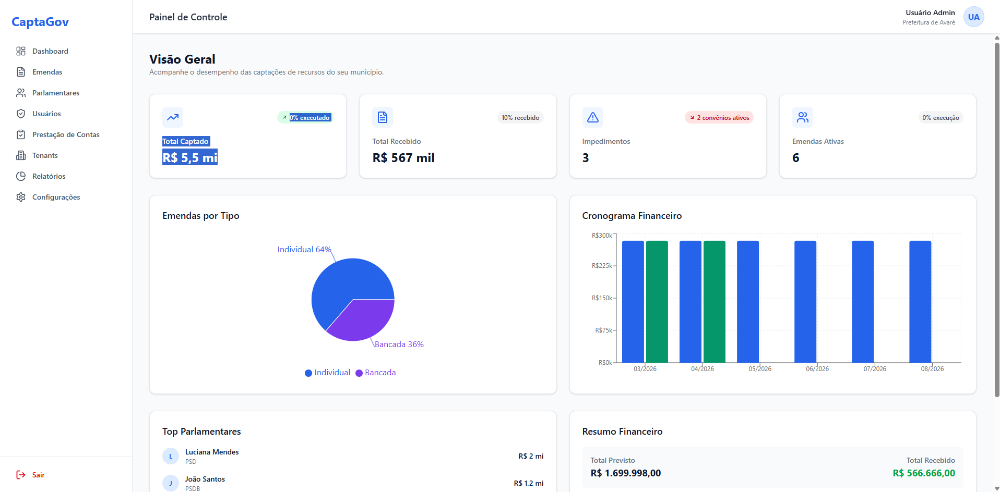

<div align="center">
  
  
  
  
</div>

<br />

<div align="center">
  <h1>CaptaGov</h1>
  <p><strong>Plataforma SaaS Multi-Tenant para Gestão de Emendas Parlamentares</strong></p>
  <p>Sistema completo para gestão do ciclo de vida de emendas parlamentares, convênios, impedimentos e prestação de contas — do planejamento à execução financeira.</p>
</div>

<br />

<p align="center">
  
</p>

<br />

## Funcionalidades

### Gestão de Emendas
- Cadastro e acompanhamento de emendas individuais e de bancada
- Múltiplos status: Pendente, Aprovada, Empenhada, Liquidada, Paga
- Beneficiários por emenda com valores individuais
- Histórico completo de alterações

### Convênios
- Controle de convênios vinculados a emendas
- Cronograma financeiro com parcelas previstas x realizadas
- Execução física por etapa (Project Stages)
- Situações: Rascunho, Ativo, Concluído, Cancelado

### Impedimentos
- Registro e acompanhamento de impedimentos por emenda
- Status: Aberto, Em Andamento, Resolvido
- Histórico de alterações de status

### Prestação de Contas
- Relatórios de prestação de contas por convênio
- Itens de prestação com valores individuais
- Workflow de aprovação: Rascunho → Submetido → Aprovado/Rejeitado

### SIOP — Sincronização Automática
- Integração com a **API GraphQL do SIOP** (Sistema Integrado de Planejamento e Orçamento)
- Sincronização automática de emendas, parlamentares, beneficiários e impedimentos
- Agendamento periódico via **BullMQ** com fila de reprocessamento (DLQ)
- Endpoints para sincronização manual e consulta de status

### Dashboard Analítico
- Visão geral com KPIs: total captado, recebido, executado
- Gráficos por tipo de emenda e cronograma financeiro
- Top parlamentares por valor de emenda
- Alertas inteligentes do sistema

### Controle de Acesso
- Multi-Tenancy com isolamento completo de dados por tenant
- RBAC com 5 papéis: Super Admin, Admin Municipal, Gestor, Operador, Visualizador
- 50+ permissões granulares

### Infrastructure
- Documentos com versionamento
- Auditoria completa (AuditLog)
- Notificações e alertas
- Geração de relatórios (PDF, XLSX, CSV)

<br />

## Stack

### Frontend
| Tecnologia | Versão |
|---|---|
| [Next.js](https://nextjs.org/) | 16 |
| [React](https://react.dev/) | 19 |
| [TypeScript](https://www.typescriptlang.org/) | 5 |
| [Tailwind CSS](https://tailwindcss.com/) | 4 |
| [React Query](https://tanstack.com/query/latest) | 5 |
| [React Hook Form](https://react-hook-form.com/) + [Zod](https://zod.dev/) | — |
| [Recharts](https://recharts.org/) | — |
| [Lucide](https://lucide.dev/) | — |

### Backend
| Tecnologia | Versão |
|---|---|
| [NestJS](https://nestjs.com/) | 11 |
| [TypeScript](https://www.typescriptlang.org/) | 5 |
| [Prisma ORM](https://www.prisma.io/) | 5 |
| [PostgreSQL](https://www.postgresql.org/) | 16 |
| [Redis](https://redis.io/) | 7 |
| [RabbitMQ](https://www.rabbitmq.com/) | 3 (Management) |
| [BullMQ](https://bullmq.io/) | — |
| [Passport](https://www.passportjs.org/) (JWT) | — |
| [Swagger](https://swagger.io/) | — |

<br />

## Arquitetura

```
captagov/
├── apps/
│   ├── api/          # NestJS Backend (porta 3001)
│   └── web/          # Next.js Frontend (porta 3000)
├── packages/
│   └── shared/       # Tipos e enums compartilhados
├── docker/
│   ├── docker-compose.yml       # Desenvolvimento
│   ├── docker-compose.prod.yml  # Produção
│   ├── Dockerfile.api
│   └── Dockerfile.web
└── .specs/           # Especificações do projeto
```

<br />

## Quick Start

### Pré-requisitos
- Docker e Docker Compose
- Node.js >= 20

### Subindo o ambiente

```bash
# Clone o repositório
git clone https://github.com/seu-usuario/captagov.git
cd captagov

# Copie as variáveis de ambiente
cp .env.example .env

# Inicie todos os serviços
npm run docker:up

# Execute as migrations e seed
docker compose -f docker/docker-compose.yml exec api npx prisma migrate dev
docker compose -f docker/docker-compose.yml exec api npx tsx prisma/seed.ts

# (Opcional) Popule com dados de demonstração
docker compose -f docker/docker-compose.yml exec api npx tsx prisma/seed-demo.ts
```

### Acessando

| Serviço | URL |
|---|---|
| **Frontend** | [http://localhost:3000](http://localhost:3000) |
| **API** | [http://localhost:3001/api/v1](http://localhost:3001/api/v1) |
| **Swagger** | [http://localhost:3001/api/docs](http://localhost:3001/api/docs) |
| **RabbitMQ** | [http://localhost:15672](http://localhost:15672) (guest/guest) |
| **MailHog** | [http://localhost:8025](http://localhost:8025) |

### Credenciais Padrão

```
E-mail:  admin@captagov.com
Senha:   Admin@123
```

<br />

## Comandos Úteis

```bash
# Desenvolvimento (local, sem Docker)
npm run dev              # Inicia API + Web em paralelo

# Docker
npm run docker:up        # Sobe todos os serviços
npm run docker:down      # Derruba todos os serviços
npm run docker:logs      # Logs em tempo real

# Banco de Dados
npm run db:migrate       # Rodar migrations
npm run db:seed          # Seed inicial (usuários, papéis, permissões)
npm run db:studio        # Prisma Studio (interface gráfica do banco)

# Testes
npm run test             # Testes unitários
npm run test:e2e         # Testes end-to-end

# Lint e Formatação
npm run lint             # ESLint
npm run format           # Prettier
```

<br />

## Ambiente de Produção

```bash
# Configure as variáveis de ambiente de produção
# (SIOP_API_TOKEN, JWT_SECRET, etc.)

# Suba com o compose de produção
docker compose -f docker/docker-compose.prod.yml up -d
```

<br />

## Licença

MIT
